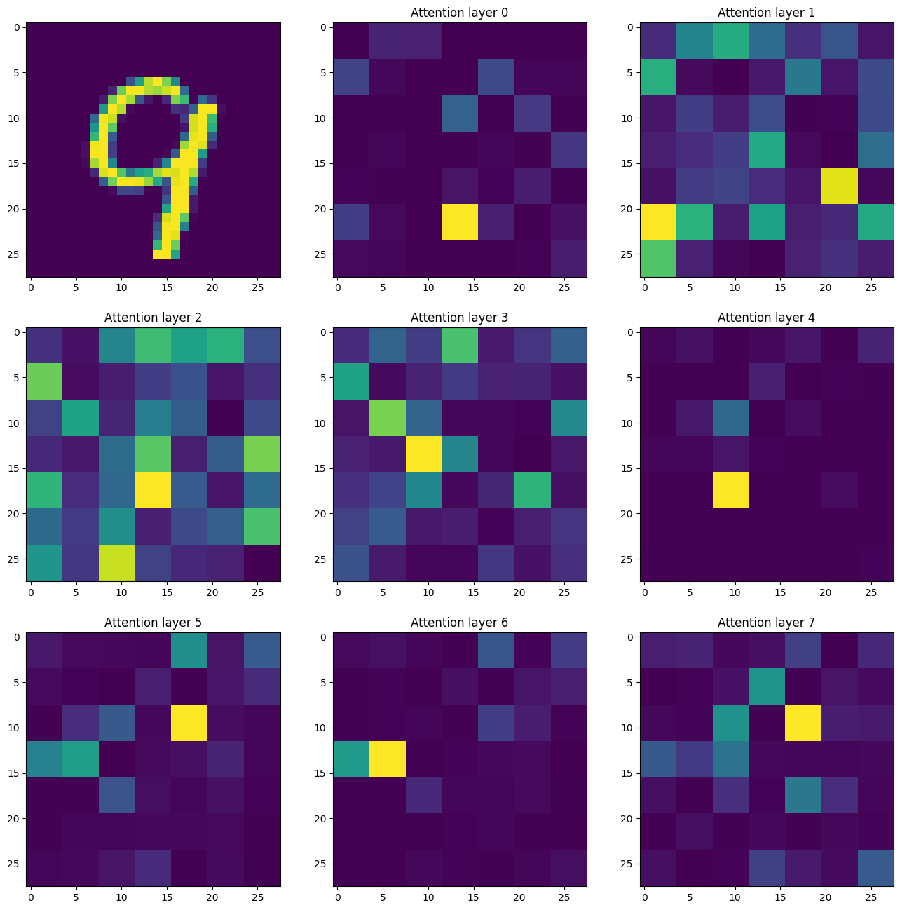
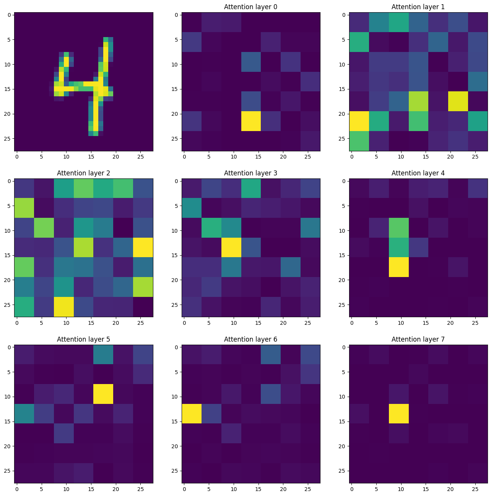
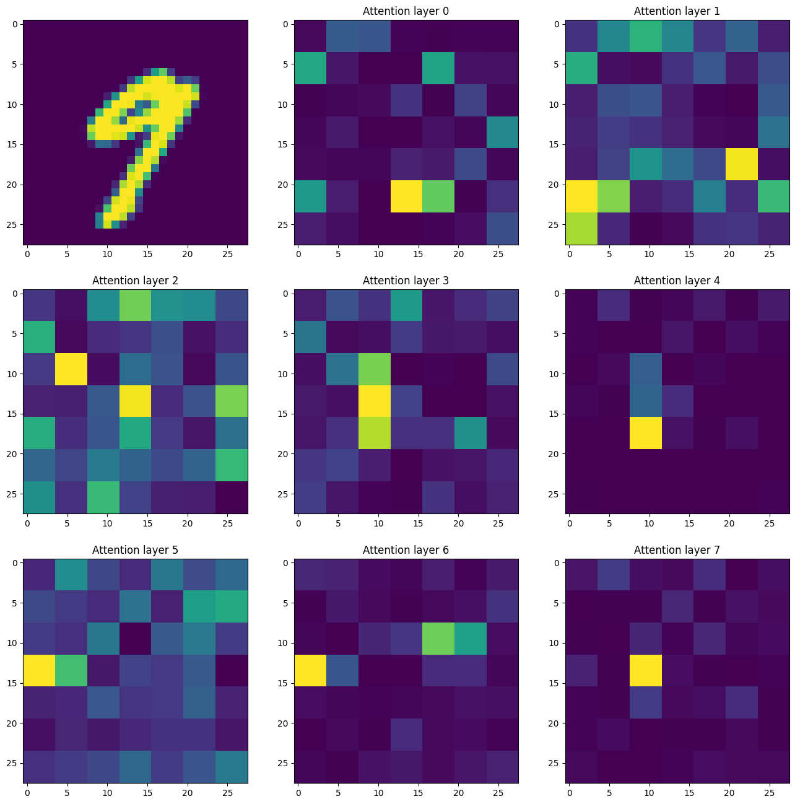

# Attention and Vision Transformer

A small educational project where I've implemented single headed attention and a primitive version of the Vision [Transformer](https://arxiv.org/abs/2202.06709). The model uses a learnable global positional embedding and splits the input images into patches of 4x4 pixels. To test the implementation I've trained it on the classic MNIST Digits dataset using the standard classification task. The model works very well and achieves 89 % accuracy on the validation set after twenty training epochs.

### Installation and Running

This project uses the [uv](https://docs.astral.sh/uv/) package manager. To run the training script simply stand in the root and run the command:

```
uv run python scripts/train.py
```

When the training is finished a torch checkpoint will be saved at `vit_model.pth`. I've saved some checkpoints in the `checkpoints` directory as well.

## Visalizations

To further investigate how the attention mechanism works I've extracted the attention weights for each of the eight transformer layers and visualized them along with the original image. 

<figure>
  
  <figcaption>Figure 1: Image and Attention Maps for sample 14.</figcaption>
</figure>

<figure>
  
  <figcaption>Figure 2: Image and Attention Maps for sample 20.</figcaption>
</figure>

<figure>
  
  <figcaption>Figure 3: Image and Attention Maps for sample 21.</figcaption>
</figure>

It seems like the weights of the attention layers two and three donesn't really correspond to intresting parts of the input images while the last three layers closer follows the contours of the input digits.

## Details 

Implemented and trained on Dell XPS 15 using a GeForce RTX 3090. The model is roughly ~7k parameters large and took about 5 minutes to train for 20 epochs.
